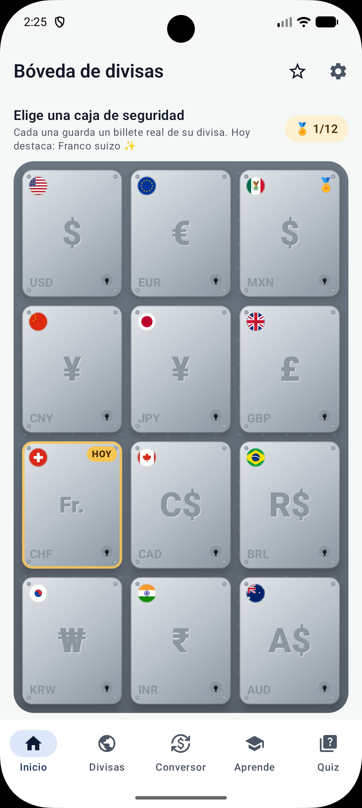
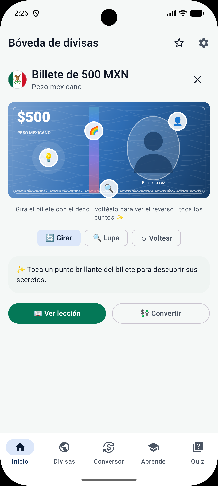
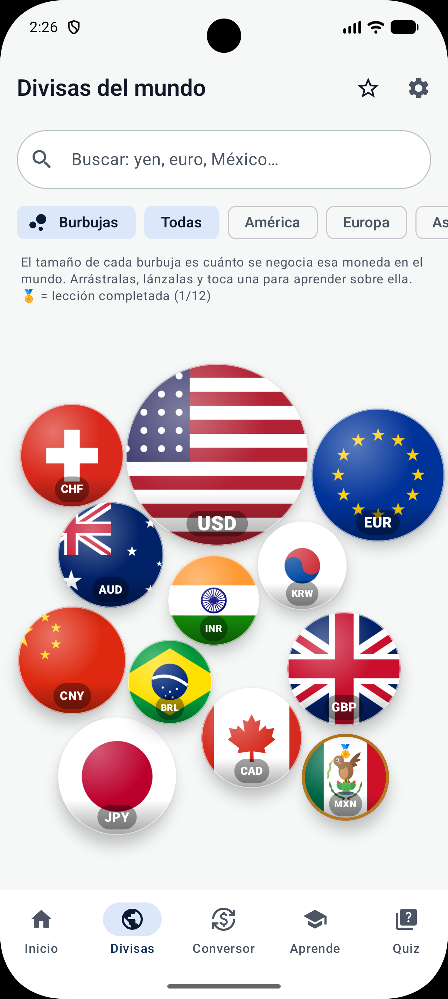
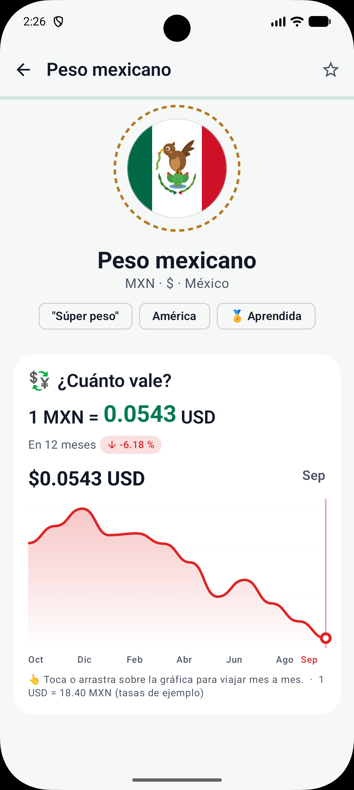
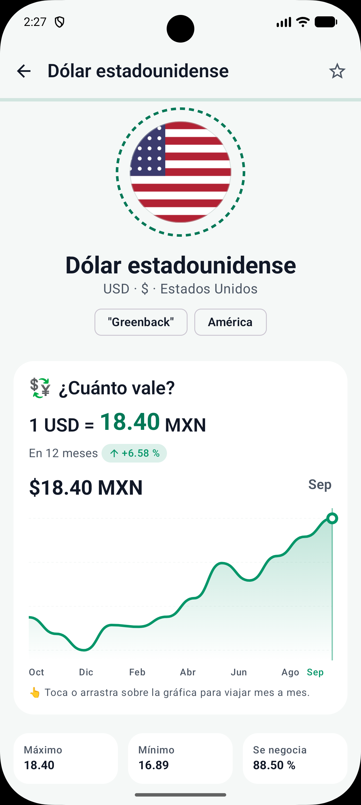
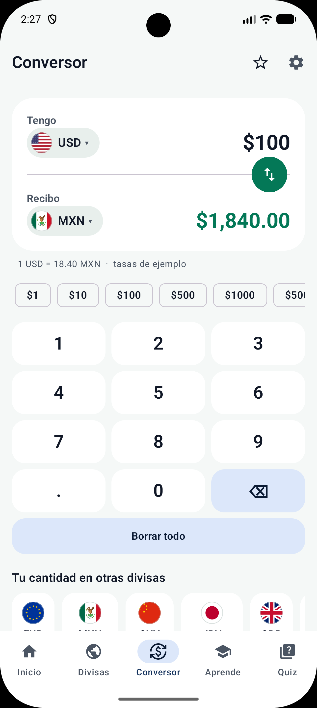
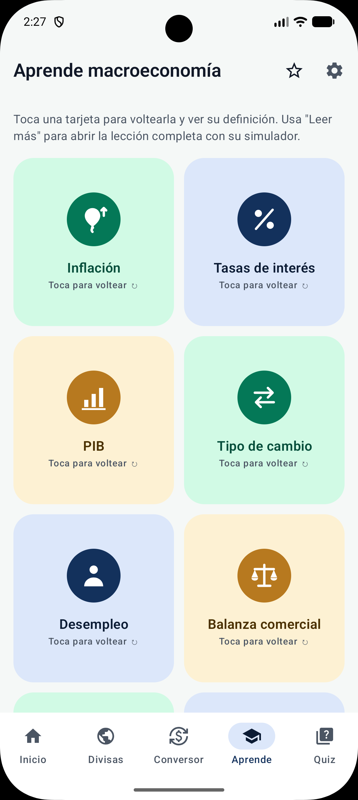
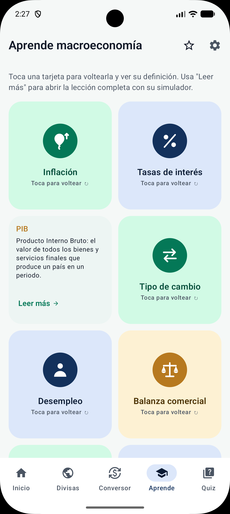
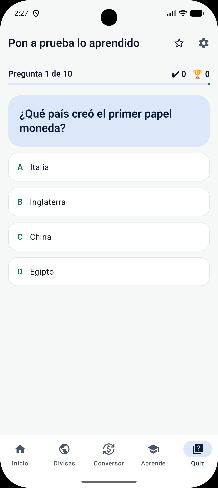

# ActiviteFinance — Divisas y macroeconomía

App educativa para Android, hecha en **Kotlin + Jetpack Compose**, para conocer las divisas más importantes del mundo y los conceptos básicos de la macroeconomía de forma **visual e interactiva**: una bóveda de banco con billetes que se giran, divisas que flotan como burbujas, lecciones animadas, simuladores y un quiz.

El proyecto está construido con **6 Activities y 6 Fragments**. Todos los datos son locales, así que la app funciona sin internet.

<p align="center">
  
  
  
</p>

---

## ¿De qué trata?

La app enseña **12 divisas**: dólar estadounidense (USD), euro (EUR), peso mexicano (MXN), yuan (CNY), yen (JPY), libra esterlina (GBP), franco suizo (CHF), dólar canadiense (CAD), real brasileño (BRL), won surcoreano (KRW), rupia india (INR) y dólar australiano (AUD).

De cada una muestra su historia, su banco central, su evolución en 12 meses, curiosidades y un billete representativo. También explica **8 conceptos de macroeconomía**: inflación, tasas de interés, PIB, tipo de cambio, desempleo, balanza comercial, reservas internacionales y bancos centrales.

> ⚠️ Las tasas de cambio son **valores de ejemplo** con fines educativos, no cotizaciones en tiempo real.

---

## 📱 Pantallas

### Inicio: la bóveda de divisas

Al entrar, una puerta de bóveda gira su volante y se abre. Detrás hay un muro de **12 cajas de seguridad** con el símbolo de cada divisa grabado en el acero. La divisa del día brilla en dorado y las lecciones completadas llevan una insignia.

Al tocar una caja la vista se acerca, la puerta se abre y sale el **billete de esa divisa**:

- Se **gira con el dedo** y se voltea para ver el reverso; la franja holográfica cambia de color al inclinarlo.
- Tiene **puntos de seguridad** que se pueden tocar: retrato, marca de agua o ventana de polímero, holograma, microimpresión y su valor en tu moneda.
- Con el modo **🔍 Lupa** aparece el texto diminuto que imprimen los bancos centrales.

| Bóveda | Billete |
|:---:|:---:|
|  |  |

### 🫧 Divisas: burbujas flotantes

Cada divisa es una burbuja con su bandera. **Su tamaño corresponde a cuánto se negocia en el mundo** (encuesta trienal del BIS, 2022). Las burbujas flotan con física: se pueden arrastrar, lanzar y chocan entre sí. Al tocar una, las demás salen despedidas y se abre su lección. Incluye búsqueda, filtros por región y una vista de lista clásica.

### 📖 Lección de una divisa

Una lección animada que se descubre al hacer scroll:

- Valor actual con contador animado y **gráfica de 12 meses** que se recorre con el dedo.
- **Línea del tiempo** con 4 momentos clave de su historia.
- Su **banco central**.
- **Curiosidades** en un mazo de tarjetas que se deslizan.
- **Mini-quiz** final: si respondes todo bien hay confeti 🎉 y ganas la insignia de esa divisa.

| Burbujas | Lección (MXN) | Lección (USD) |
|:---:|:---:|:---:|
|  |  |  |

### 💱 Conversor

Convierte entre cualquier par de divisas con un **teclado numérico propio**. El resultado se anima y el botón de intercambio gira. Tiene montos rápidos y muestra tu cantidad en todas las demás divisas.

### 🎓 Aprende

Los 8 conceptos de macroeconomía en **tarjetas que se voltean** en 3D. Cada lección tiene un ejemplo práctico y, según el concepto, un **simulador**:

- ¿Cuánto valdrán $1,000 con cierta inflación?
- Interés compuesto y la regla del 72.
- Mover el tipo de cambio USD/MXN.
- Crecimiento del PIB.

### Quiz

10 preguntas al azar de un banco de 25. La opción incorrecta se sacude, cada respuesta trae su explicación y al final se guarda tu récord.

| Conversor | Aprende | Tarjeta volteada | Quiz |
|:---:|:---:|:---:|:---:|
|  |  |  |  |

### Además

- **⭐ Favoritos:** divisas marcadas; se quitan deslizando, con opción de "Deshacer".
- **⚙️ Ajustes:** divisa base (MXN por defecto), tema claro / oscuro / sistema, reinicio del récord y de la introducción.
- **Splash** animado y una **introducción** de 3 páginas con efecto parallax.

---

## Estructura: 6 Activities + 6 Fragments

| # | Activity | Qué hace |
| --- | ---------- | ---------- |
| 1 | `SplashActivity` | Moneda girando con símbolos en órbita; decide si mostrar la introducción |
| 2 | `OnboardingActivity` | Introducción de 3 páginas (solo la primera vez) |
| 3 | `MainActivity` | Hospeda los 6 Fragments con transiciones animadas y barra inferior |
| 4 | `CurrencyDetailActivity` | Lección animada de una divisa |
| 5 | `ConceptDetailActivity` | Lección de un concepto macro con simulador |
| 6 | `SettingsActivity` | Divisa base, tema y progreso |

| # | Fragment | Qué hace |
| --- | ---------- | ---------- |
| 1 | `HomeFragment` | Bóveda con cajas de seguridad y billetes 3D |
| 2 | `CurrenciesFragment` | Burbujas flotantes o lista, con búsqueda y filtros |
| 3 | `ConverterFragment` | Conversor con teclado propio |
| 4 | `LearnFragment` | Conceptos en tarjetas que se voltean |
| 5 | `QuizFragment` | Trivia con récord |
| 6 | `FavoritesFragment` | Divisas favoritas |

`MainActivity` cambia de Fragment con `supportFragmentManager.commit { setCustomAnimations(...); replace(...) }`. Cada Fragment dibuja su interfaz con Compose (`content { }` de `fragment-compose`).

```
app/src/main/java/com/gusslinaresv/activitefinanca/
├── data/          Divisas, conceptos, quiz, billetes y preferencias (datos locales)
│   └── model/     Modelos: Currency, Concept, Milestone, QuizQuestion…
├── ui/
│   ├── activities/  Las 6 Activities
│   ├── fragments/   Los 6 Fragments
│   ├── components/  Bóveda, billete, burbujas, gráficas, simuladores, lección…
│   └── theme/       Paleta esmeralda / marino / dorado, modo oscuro
└── viewmodel/     FinanceViewModel (compartido) y QuizViewModel
```

---

## Gráficos

No se descargó ninguna imagen. Todo está **generado dentro del proyecto**:

- **Banderas** de las 12 divisas, **ilustraciones**, **íconos** de conceptos e **ícono de la app** como *VectorDrawables* (`res/drawable/`).
- **Billetes, bóveda, burbujas, gráficas y confeti** dibujados con Compose `Canvas`.
- **Animaciones** con las APIs de Compose, sin librerías externas.

---

## 🛠️ Tecnologías

- **Kotlin 2.2** · **Jetpack Compose** (Material 3, BOM 2026.02)
- **AndroidX Fragment 1.8** con `fragment-compose`
- **ViewModel** + `StateFlow`
- **SharedPreferences** para favoritos, divisa base, tema, récord e insignias
- **Android Gradle Plugin 9.4** · minSdk 24 · targetSdk 37

## ▶️ Cómo ejecutarla

1. Clona el repositorio:

   ```bash
   git clone https://github.com/GusLV12/Divisas-macro-economia.git
   ```

2. Ábrelo en **Android Studio** (usa el JDK que trae Android Studio).
3. Elige un emulador o dispositivo con Android 7.0 (API 24) o superior y presiona **Run ▶**.

Desde la terminal:

```bash
./gradlew installDebug
```

---

## 👤 Autor

**Gustavo LV** — [@GusLV12](https://github.com/GusLV12)
